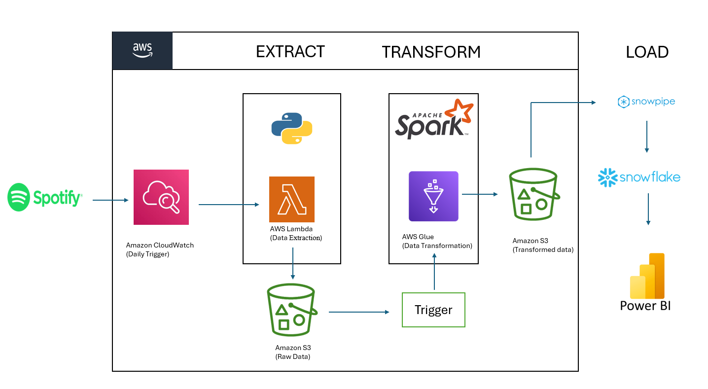
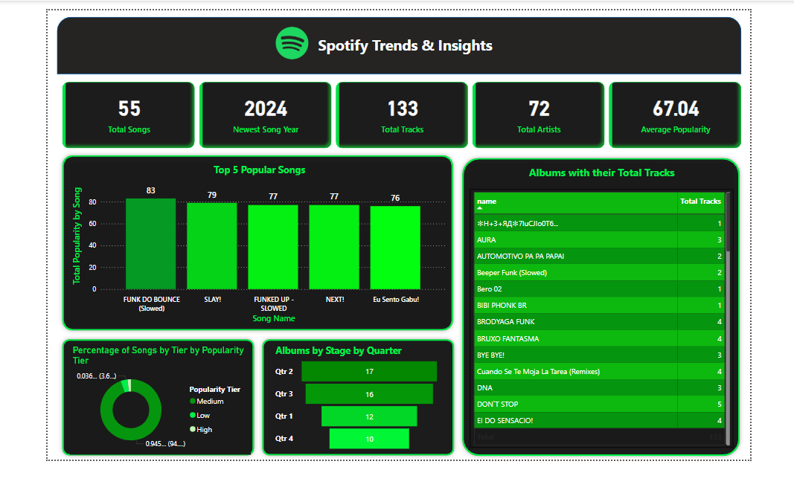

# Spotify_ETL_Pipeline

This project implements an automated ETL (Extract, Transform, Load) pipeline for Spotify playlist data using AWS services, Snowflake, and Power BI. The objective is to extract data from Spotify playlists, transform it into structured formats, and load it into a Snowflake database for advanced analytics and visualization.

## Workflow 

### 1. Data Extraction: AWS Lambda
Data is extracted from the Spotify API using SpotifyClientCredentials. The credentials (Client ID and Secret) are securely stored as environment variables in the Lambda function.

The lambda_function.py script performs the following tasks:

Connects to the Spotify API and retrieves playlist data in JSON format.

Stores the raw data in an Amazon S3 bucket (spotify-data-manvith) under raw_data/to-be-processed_data/, naming each file with a timestamp for uniqueness.

Automatically triggers an AWS Glue job (Spotify_transformation_job) to initiate data transformation.

The Lambda function runs every minute via an Amazon CloudWatch Events rule.

### 2. Data Transformation: AWS Glue

Data transformation is handled by the spark_transformation.py script using PySpark within a Glue context.

Key transformation steps:

Raw Data Processing: Extracts relevant fields for albums, artists, and songs.

Custom Functions:

process_album: Extracts album metadata.

process_artists: Extracts artist information.

process_songs: Extracts song details and links them with their respective albums and artists.

Transformations:

Flattens nested JSON structures using explode.

Formats the added_at field into a standardized date format.

Output: Transformed data is saved as CSV files in Amazon S3 under the transformed_data/ directory, organized by type (album, artists, songs).

### 3. Data Loading: Snowflake
A Snowflake SQL script (snowflake.sql) creates the database (spotify_db) with tables for albums (tbl_album), artists (tbl_artists), and songs (tbl_songs).

Snowpipe Integration:

Amazon S3 (spotify-data-manvith) is integrated with Snowflake using Storage Integration (s3_init).

Snowpipe automatically loads the transformed CSV data from S3 into the corresponding Snowflake tables.

### 4. Data Visualization: Power BI
The Snowflake tables are connected to Power BI to create interactive dashboards and visualizations.

Insights provided include:

Top 10 artists by song popularity

Top 10 albums by overall popularity

Summary of song durations

Album metrics, such as track counts

These visualizations offer deep insights into Spotify usage and trends.

### Key Features
End-to-End Automation: From data extraction to visualization, the entire pipeline is automated via CloudWatch triggers and Snowpipe.

Scalability: AWS Lambda and Glue handle large data volumes efficiently.

Near Real-Time Updates: Snowpipe ensures timely data loading into Snowflake.

Flexible Transformations: Easily adaptable to various data structures or new requirements.

### Resources
lambda_function.py: AWS Lambda script for data extraction

spark_transformation.py: PySpark script for data transformation in Glue

snowflake.sql: SQL script to set up Snowflake database and tables

Power BI dashboard for data visualization

### Tools
APIs & Languages: Spotify API, Python, PySpark, SQL

AWS Services: Lambda, CloudWatch, S3, Glue, IAM

Data Storage & Processing: Snowflake, Snowpipe

Data Formats: JSON, CSV

Visualization: Power BI
